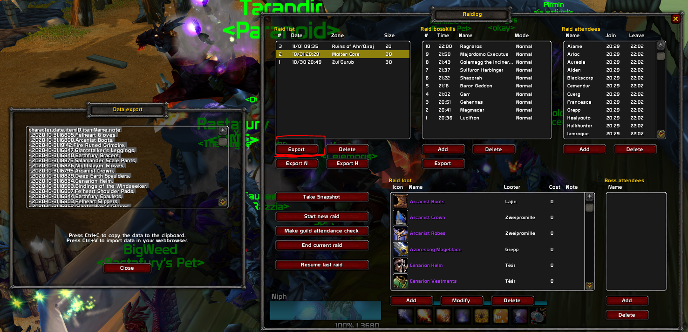

# Fork of Classic Raid Tracker

> Keeps account of attendance and loot for raids. Adaption of https://legacy-wow.com/mop-addons/mizus-raid-tracker/ to work with World of Warcraft Classic. For retail please use the original project.

# thatsmybis.com
this version was updated to replace the original HTML export with a https://www.thatsmybis.com compatible version. Small dirty hacks that are not properly tested have been added to start logging automatically once an instance is entered.

## configuration
Open `Interface Options -> Classic RaidTracker`

* Raid Tracking
  - Enable automatic tracking
* Item tracking
  - Disable: `Ask for item cost`
  - Disable: `... if loot mode is personal loot`
* Attendance options
  - Disable everything except: `Ask for confirmation`
* Export
  - Export format: `thatsmybis.com`
  - Activate: `Export zone names and boss names in english`
  - Activate: `Ignore per boss attendance`
  - Deactivate everything else
  

## Usage
Our raid distributes loot at the end of the raid, to make it easier the addon tracks all looted items that are then distributed via trade to the member that is elightable for the item. Thus the character name is hardcoded to `-`

* Enter any raid - Addon should create a new raid automatically 
* you can check the current status by typing `/mrt`
* Kill all bosses and type `/mrt` 
* In the raid list choose the raid you want to export and click on the `Export` button which is located in the top left above `Export N`.
* Click `End current raid` (no idea what happens if you don't)
* Paste data into thatsmybis.com

# Credit
Credit goes to the original authors - I have no idea about LUA so expect bugs. 
THE SOFTWARE IS PROVIDED "AS IS", WITHOUT WARRANTY OF ANY KIND, EXPRESS OR FITNESS FOR A PARTICULAR PURPOSE
